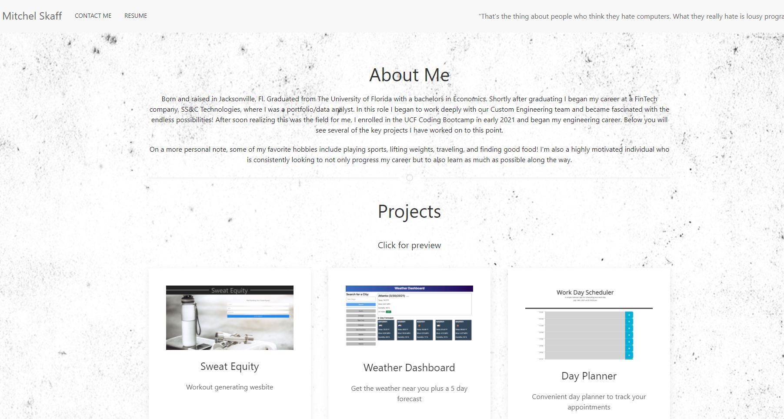

# My-Portfolio-V2
Updated portfolio page with new features learned in the course to this point! Included in the portfolio are options for you to be able to contact me, links to my GitHub, LinkedIn, and Resume as well as my recent projects for you to view interactively!

Check out the deployed site here: https://mitch-skaff.github.io/My-Portfolio-V2/

